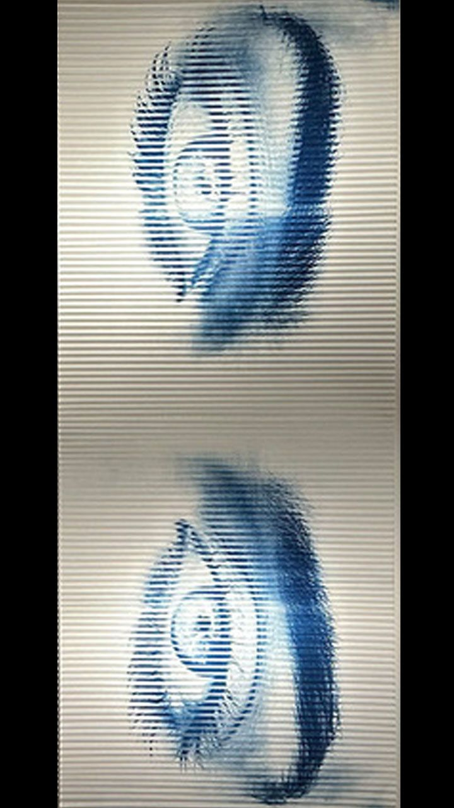

# RA 2026 · Ojos Clara

Experiencia de realidad aumentada hecha con [8th Wall Studio](https://8thwall.org). Al apuntar la cámara a la obra *Ojos Clara*, aparece contenido anclado a la imagen: video, modelos 3D con animación y un occluder. Tiene un botón para sacar foto (tocar) o grabar video (mantener).



## Estructura

```
image-targets/            Target de imagen (lo genera la app de 8th Wall al importar)
  ojos-clara.json         Configuración del target (nombre, recorte)
  ojos-clara_*.jpg        Original, recorte, luminancia y miniatura
src/
  .expanse.json           Escena de 8th Wall Studio (se edita desde la app)
  app.js                  Carga el target en el motor de tracking
  index.html              Página base
  components/
    capture-button.js     Botón de foto / video
    video-pause-on-lost.ts  Reproduce el video al encontrar el target y lo pausa al perderlo
  assets/
    models/               Modelos 3D (.glb / .gltf)
    video/                Videos
config/                   Build con webpack (no hace falta tocarlo)
```

### La escena

```
Principal
├── Camera, Ambient Light, Directional Light
└── Image Target (ojos-clara)
    ├── Occluder   caja invisible (material hider) detrás de la imagen
    ├── Video      plano con assets/video/waves.mp4
    ├── 0_Card_Front / 0_Card_Container
    └── Esferas    con scale-animation
```

## Cambiar el target

1. Importa la imagen nueva desde la app de 8th Wall (panel *Image Targets*). Evita bordes negros agregados: el recorte debe tener la mayor parte de la imagen real.
2. Pon el nombre del target en el objeto *Image Target* de la escena y en el parámetro *imageTargetName* del componente *Pause Video on Image Target Lost*.
3. Cambia el `require` en [src/app.js](src/app.js) al nuevo `.json`.

Los tres nombres tienen que coincidir, si no el target no se detecta.

## Desarrollo

Con la app de escritorio: [instálala](https://8thwall.org/downloads), haz clic en *Open* y elige esta carpeta.

Sin la app, para probar en el celular:

```bash
npm install
npm run dev -- --host
```

Abre en el celular la dirección `https://<ip-de-tu-computadora>:<puerto>` que aparece en la terminal (misma red Wi-Fi) y acepta la advertencia del certificado.

> No edites `src/.expanse.json` a mano con la app abierta: al guardar, la app sobrescribe el archivo.

## Publicación

Configurado para Netlify en `netlify.toml` (build: `npm run build`, publica `dist`). Cada push a `main` vuelve a publicar si el repo está conectado en Netlify.

## Créditos

Basado en el ejemplo [Studio: Image Targets](https://github.com/8thwall) de 8th Wall (licencia en [LICENSE](LICENSE)).
